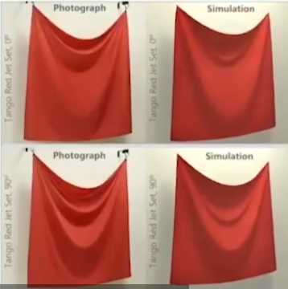

+++
title = 'Games101 Talk 1'
date = 2024-10-09T18:46:17+08:00
draft = false
+++

记个笔记，用来 review

## Lecture 1 Overview of Computer Graphics

### 课程主题

Rasterization 光栅化

Curves and Meshes 曲线和曲面

Ray Tracing 光线追踪

Animation / Simulation 动画/模拟

#### Rasterization 光栅化

把三维空间的几何形体显示在屏幕上就是光栅化。

- Project geometry primitives (3D triangles / polygons) onto the screen 投影几何形体(三角形/多边形)到屏幕上
- Break projected primitives into fragments (pixels) 分解投影的形体为像素
- Gold standard in Video Games (Real-time Applications) 通用于电子游戏(实时应用)

实时的标准：30 frames per second

#### Curves and Meshes 曲线和曲面

在 Computer Graphics 计算机图形学中表示几何的方法。

#### Ray Tracing 光线追踪

Shoot rays from the camera through each pixel 从摄像机射出光线

Calculate intersection and shading 计算介质和着色

Continue to bounce the rays till they hit light sources 继续弹射直到击中光源

Gold standard in Animations/Movies (Offline Applications) 通用于动画/电影

tradeoff: ray tracing 慢但效果好

现代的改进：实时光线追踪

#### Animation / Simulation 动画/模拟

Key frame Animation 关键帧动画

Mass-spring System 质量-弹簧 系统

模拟悬挂的布如何褶皱



#### 杂项

opengl shader: GLSL

HLSL

虎书

作业用 C++ Eigen 库

#### 关于使用 IDE 的看法

IDE 更适合大项目的管理

没必要抵制 IDE

不要贴代码帮助别人 (也不要看代码来解决问题)

## Lecture 2 Review of Linear Algebra

### 点乘的正负性判断两个向量的接近程度

点乘大于 0 方向<90 度； 小于 0 方向>90 度

接近程度可以用来判断例如镜面反射是否能被观察到（在足够近才能被观察到）

### 叉乘判定在左右/在内外

叉积正负判定左右

在三角形的三条边同侧，即为在三角形内部

### 矩阵

$$
\begin{array}{c}
\vec{a} \times \vec{b} = A^* \vec{b} =  \\ \
\end{array}

\begin{array}{c}
\begin{pmatrix}
0 & -z_a &y_a \\
z_a & 0 & -x_a \\
-y_a & x_a & 0
\end{pmatrix} \\
\text{dual matrix of vector a}
\end{array}

\begin{array}{c}
\begin{pmatrix}
x_b \\ y_b \\ z_b
\end{pmatrix} \\ \
\end{array}
$$

$A^*$ 是 $A$ 的伴随矩阵。

## Lecture 3 Transformation 变换

### 变换的分类

- Model 模型变换
- View 视角变换

### 一些线性变换

#### Scale 缩放

缩放矩阵 $\begin{bmatrix} x^\prime \\ y^\prime \end{bmatrix} = \begin{bmatrix} s_x & 0 \\ 0 & s_y \end{bmatrix} \begin{bmatrix} x \\ y \end{bmatrix}$

#### Reflection 反射

本质是一个特殊的缩放 $\begin{bmatrix} x^\prime \\ y^\prime \end{bmatrix} = \begin{bmatrix} -1 & 0 \\ 0 & 1 \end{bmatrix} \begin{bmatrix} x \\ y \end{bmatrix}$

#### Shear

$\begin{bmatrix} x^\prime \\ y^\prime \end{bmatrix} = \begin{bmatrix} 1 & a \\ 0 & 1 \end{bmatrix} \begin{bmatrix} x \\ y \end{bmatrix}$

#### Rotate 旋转

以绕原点，逆时针旋转 $\theta$ 为例：$\begin{bmatrix} x^\prime \\ y^\prime \end{bmatrix} = \begin{bmatrix} \cos{\theta} & -\sin{\theta} \\ \sin{\theta} & \cos{\theta} \end{bmatrix} \begin{bmatrix} x \\ y \end{bmatrix}$

#### Linear Transform = Matrices 线性变换=矩阵

这是线性变换的表达式吗？$\begin{bmatrix} x^\prime \\ y^\prime \end{bmatrix} = \begin{bmatrix} a & b \\ c & d \end{bmatrix} \begin{bmatrix} x \\ y \end{bmatrix}$

#### Translation 平移

$\begin{bmatrix} x^\prime \\ y^\prime \end{bmatrix} = \begin{bmatrix} x \\ y \end{bmatrix} + \begin{bmatrix} t_x \\ t_y \end{bmatrix}$

### Homogeneous Coordinate 齐次坐标

为了不把平移当作一种特殊情况……

2D point = $\begin{pmatrix} x \\ y \\ 1 \end{pmatrix}$

2D vector = $\begin{pmatrix} x \\ y \\ 0 \end{pmatrix}$

#### 齐次坐标下的平移

$\begin{pmatrix} x^\prime \\ y^\prime \\ w^\prime \end{pmatrix} = \begin{pmatrix} 1 & 0 & t_x \\ 0 & 1 & t_y \\ 0 & 0 & 1 \end{pmatrix} \begin{pmatrix} x \\ y \\ 1 \end{pmatrix} = \begin{pmatrix} x + t_x \\ y+t_y \\ 1 \end{pmatrix}$

#### 向量和点的加减法

v+v=v

p-p=v

p+v=p

p+p=??

在齐次坐标下，$\begin{pmatrix} x \\ y \\ w \end{pmatrix} is \ the \ 2D \ point \begin{pmatrix} x/w \\ y/w \\ 1 \end{pmatrix},w \neq 0$ ，则 p+p 表示两点中点。

### Affine Transformations 仿射变换

Affine map = Linear map + Translation

齐次坐标下的仿射变换：$\begin{pmatrix} x^\prime \\ y^\prime \\ 1 \end{pmatrix} = \begin{pmatrix} a & b & t_x \\ c & d & t_y \\ 0 & 0 & 1 \end{pmatrix} \cdot \begin{pmatrix} x \\ y \\ 1 \end{pmatrix}$

#### Scale

$$
S(s_x,s_y) = \begin{pmatrix} s_x & 0 & 0 \\ 0 & s_y & 0 \\ 0 & 0 & 1 \end{pmatrix}
$$

#### Rotation

$$
R(\alpha) = \begin{pmatrix} \cos{\alpha} & -\sin{\alpha} & 0 \\ \sin{\alpha} & \cos{\alpha} & 0 \\ 0 & 0 & 1 \end{pmatrix}
$$

#### Translation

$$
T(t_x,t_y) = \begin{pmatrix} 1 & 0 & t_x \\ 0 & 1 & t_y \\ 0 & 0 & 1 \end{pmatrix}
$$

在投影变化下，最后一行不一定是 001。

#### Inverse Transform 逆变换

乘逆矩阵 = 做逆变换

#### Decompose Complex Transformations 分解复杂变换

绕点 c 旋转可以分解为 移动-c -> 绕原点旋转 -> 移动 c，即$T(c) \cdot R(\alpha) \cdot T(-c)$

### 3D Transformations 三维变换

再次使用齐次坐标

3D point = $\begin{pmatrix} x \\ y \\ z \\ 1\end{pmatrix}$

3D vector = $\begin{pmatrix} x \\ y \\ z \\ 0\end{pmatrix}$

$\begin{pmatrix} x \\ y \\ z \\ w \end{pmatrix} is \ the \ 3D \ point \begin{pmatrix} x/w \\ y/w \\ z/w \end{pmatrix},w \neq 0$

$\begin{pmatrix} x^\prime \\ y^\prime \\ z^\prime \\ 1\end{pmatrix} = \begin{pmatrix} a & b & c & t_x \\ d & e & f & t_y \\ g & h & i & t_z \\ 0 & 0 & 0 & 1\end{pmatrix} \cdot\begin{pmatrix} x \\ y \\ z \\ 1\end{pmatrix}$

#### Scale

$$
S(s_x,s_y,s_z) = \begin{pmatrix} s_x & 0 & 0 & 0 \\ 0 & s_y & 0 & 0 \\ 0 & 0 & s_z & 0 \\ 0 & 0 & 0 & 1 \end{pmatrix}
$$

#### Translation

$$
T(t_x,t_y,t_z) = \begin{pmatrix} 1 & 0 & 0 & t_x \\ 0 & 1 & 0 & t_y \\ 0 & 0 & 1 & t_z \\ 0 & 0 & 0 & 1 \end{pmatrix}
$$

#### Wait, What about Rotation?

Rotation around x-axis, y-axis and z-axis.

$$
R_x(\alpha) =
\begin{pmatrix}
1 & 0 & 0 & 0 \\
0 & \cos{\alpha} & -\sin{\alpha} & 0 \\
0 & \sin{\alpha} & \cos{\alpha} & 0 \\
0 & 0 & 0 & 1
\end{pmatrix} \\ \ \\

R_y(\alpha) =
\begin{pmatrix}
\cos{\alpha} & 0 & \sin{\alpha} & 0 \\
0 & 1 & 0 & 0 \\
-\sin{\alpha} & 0 & \cos{\alpha} & 0 \\
0 & 0 & 0 & 1
\end{pmatrix} \\ \ \\

R_z(\alpha) =
\begin{pmatrix}
\cos{\alpha} & -\sin{\alpha} & 0 & 0 \\
\sin{\alpha} & \cos{\alpha} & 0 & 0 \\
0 & 0 & 1 & 0 \\
0 & 0 & 0 & 1
\end{pmatrix} \\ \ \\

R_{xyz}(\alpha, \beta, \gamma) = R_x(\alpha) \ R_y(\beta) \ R_z(\gamma)
$$

这个分解旋转角度的方式即为欧拉角。在飞行模拟中的三个角 Roll, Pitch, Yaw

Roll 飞机倾斜程度 Pitch 飞机仰角 Yaw 飞机朝向

#### Rodrigues' Rotation Formula 罗德里格斯旋转公式

Rotation by angle $\alpha$ around axis $n$ (这里的旋转轴认为是过原点的，如果要绕不过原点的轴旋转，可以平移过去再平移回来(和 2D 的方法一样)))

$$
R(\vec{n},\alpha) = \cos(\alpha)\ \vec{I} + (1-\cos(\alpha))\ \vec{n}\vec{n}^T + \sin(\alpha)
\underbrace{
\begin{pmatrix}
0 & -n_z & n_y \\
n_z & 0 & -n_x \\
n_y & n_x & 0
\end{pmatrix}
}_{\text{N}}
$$

##### Quaternion 四元数 用来做旋转的差值

很多东西和 2D 的情况一样。

## Lecture 4 Transformation Cont.

### 目录

- 2D 旋转的扩充
- Viewing Transformation 成像变换

  - View / Camera Transformation 视图变换
  - Projection Transformation 投影变换

    - Orthographic Projection 正交投影
    - Perspective Projection 透视投影

#### 旋转的扩充

$$
\begin{array}{ll}
R(\theta) &= \begin{pmatrix} \cos{\theta} & -\sin{\theta} & 0 \\ \sin{\theta} & \cos{\theta} & 0 \\ 0 & 0 & 1\end{pmatrix} \\ \ \\
R(-\theta) &= \begin{pmatrix} \cos{\theta} & \sin{\theta} & 0 \\ -\sin{\theta} & \cos{\theta} & 0 \\ 0 & 0 & 1\end{pmatrix} &= R(\theta)^T \\ \ \\
R(-\theta) &= R(\theta)^{-1} \ (by \ definition)
\end{array}
$$

由 $R(\theta)^T = R(\theta)^{-1}$ 这一性质可见 $R$ 是正交矩阵。

#### View / Camera Transformation 视图变换

类比成拍照的话...

- model transformation 确定拍照的对象
- view transformation 确定拍照的角度
- projection transformation 拍照! (把三维投影到二维)

##### 定义相机的位置

- Position $\vec{e}$ 固定相机的位置
- Look-at / gaze direction $\hat{g}$ 固定相机的朝向
- Up direction $\hat{t}$ 固定相机的角度中朝上的方向(在与朝向方向垂直的面的上)

##### 相机的标准位置

把相机固定在原点, Up 为 Y 轴, 朝向-Z 方向。可以减少很多不必要的麻烦。

##### 移动相机到标准位置 $M_{view}$

对于一个位于 $\begin{pmatrix} \ \vec{e} & \hat{g} & \hat{t} \ \end{pmatrix}$ 的相机，要将其移动到标准位置

1. 移动相机由 $e$ 到原点 $T_{view}$
2. 旋转相机由 $\hat{g},\hat{t}$ 到标准位置 $R_{view}$

$$
M_{view}= R_{view} T_{view}
$$

其中，显然 Translate e to origin:

$$
T_{view} =
\begin{bmatrix}
1 & 0 & 0 & -x_e \\
0 & 1 & 0 & -y_e \\
0 & 0 & 1 & -z_e \\
0 & 0 & 0 & 1
\end{bmatrix}
$$

然后旋转 Rotate g to -Z, t to Y, (g x t) to X

这个明显比较复杂，我们可以首先考虑将标准位置移动到原位置的矩阵，即所需旋转矩阵的逆矩阵 X to (g x t), Y to t, Z to -g:

$$
R^{-1}_{view} =
\begin{bmatrix}
x_{\hat{g}\times\hat{t}} & x_t & x_{-g} & 0 \\
y_{\hat{g}\times\hat{t}} & y_t & y_{-g} & 0 \\
z_{\hat{g}\times\hat{t}} & z_t & z_{-g} & 0 \\
0 & 0 & 0 & 1
\end{bmatrix}
$$

再由 $R_{view}$ 是正交矩阵，则 $R^{-1}_{view} = R^T_{view}$ ，转置 $R^{-1}_{view}$ 即可得到我们所需的 $R_{view}$ :

$$
R_{view} =
(R^{-1}_{view})^T =
\begin{bmatrix}
x_{\hat{g}\times\hat{t}} & y_{\hat{g}\times\hat{t}} & z_{\hat{g}\times\hat{t}} & 0 \\
x_t & y_t & z_t & 0 \\
x_{-g} & y_{-g} & z_{-g} & 0 \\
0 & 0 & 0 & 1
\end{bmatrix}
$$

#### Projection Transformation 投影变换

##### Orthographic Projection 正交投影 $M_{ortho}$

标准位置下:

- 摄像机在标准位置
- 去掉所有物体的 Z
- 将结果移动和缩放到 [-1,1]^2 的正方形内

通常情况下:

- 定义立方体的左右在 x 轴上是多少，下上在 y 轴上是多少，远近在 z 轴上是多少
- 把这个[l,r] x [b,t] x[f,n] 映射到标准立方体[-1,1]^3 (因为用的是-Z 轴，所以远比近大)

$$
M_{ortho} =
\begin{bmatrix}
\frac{2}{r-l} & 0 & 0 & 0 \\
0 & \frac{2}{t-b} & 0 & 0 \\
0 & 0 & \frac{2}{n-f} & 0 \\
0 & 0 & 0 & 1
\end{bmatrix}

\begin{bmatrix}
1 & 0 & 0 & -\frac{r+l}{2} \\
0 & 1 & 0 & -\frac{t+b}{2} \\
0 & 0 & 1 & -\frac{n+f}{2} \\
0 & 0 & 0 & 1
\end{bmatrix}
$$

##### Perspective Projection 透视投影 $M_{persp}$

###### 怎么透视投影呢

- 先把 Frustum 挤压成 Cuboid (把远的压到和近的一样大(?)) $M_{persp \to ortho}$
- 然后做正交投影 $M_{ortho}$

$x,\ y$ 的变换比较简单 $ y^{\prime} = \frac{n}{z}y \ \ \ \ x^{\prime} = \frac{n}{z}x $

此处 $n$ 是近面， $f$ 是远面投影到近面不动的点 (对写的是 $f$, 但是这里还没有 $f$ ，等下就有了)

$z$ 比较复杂，我们先给出变化后的向量: $\begin{pmatrix} nx \\ ny \\ unknown \\ z \end{pmatrix}$

这里经过了一段奇妙的推理 (近面上的点不动，不动点不动) 后给出了方程:

$$
M_{persp \to ortho} =
\begin{bmatrix}
n & 0 & 0 & 0 \\
0 & n & 0 & 0 \\
0 & 0 & n+f & -nf \\
0 & 0 & 1 & 0
\end{bmatrix}
$$

## Lecture 5 Rasterization (Triangles)

上期发现记笔记效率有点低，这期开始可能英文会比较多，前文提及的概念不打中文，也不纠错字了（对于中文输入错误的情况，会比较难以忽视），以此提高笔记效率

#### 继续投影变换

那么上一期讲到把远面缩放到近面——这里的近面又是什么呢？是随便一个足够近的面吗？

实际上这里的近面也应是良定义的，我们有两个 factor 描述它: fovY and aspect ratio， 即 Y 轴视角大小和视宽比，此处 aspect ratio = width / height

##### 从 fovY 和 aspect 计算 l, r, b, t

$$
\begin{array}{clc}
\tan{\frac{fovY}{2}} &=  &\frac{t}{|n|} \\
aspect &= &\frac{r}{t}
\end{array}
$$

##### After MVP? 变换之后呢

- **M**odel Transformation (placing objects)
- **V**iew Transformation (placing camera)
- **P**rojection Transformation
  - Orthographic projection (cuboid to "canonical" cube [-1,1]^3)
  - Perspective projection (frustum to "ccanonical" cube)

###### Canonical Cube to Screen 将标准立方体投影至屏幕

- What is a screen?

  - An array of pixels
  - Size of this array: resolution
  - A typical kind of raster display 一种典型的光栅显示

- Raster == screen in German

  - Rasterize == drawing onto the screen

- Pixel (FYI, short for "picture element")

  - For now: A pixel is a little square with uniform color
  - Color is a mixture of (**R**ed, **G**reen, **B**lue)

- Defining the screen space

  - 从左下角开始（和虎书以及很多引擎不太一样）
  - 形式为(x,y), both x n' y are integers
  - range is from (0,0) to (width, height)
  - pixel is centered at (x+0.5,y+0.5)

- Time to Canonical Cube to Screen!

  - 与 z 无关
  - xy 的变换: [-1,1]^2 to [0,width] x [0,height]
  - Viewport transform matrix:

$$
M_{viewport} =
\begin{bmatrix}
\frac{width}{2} & 0 & 0 & \frac{width}{2} \\
0 & \frac{height}{2} & 0 & \frac{height}{2} \\
0 & 0 & 1 & 0 \\
0 & 0 & 0 & 1
\end{bmatrix}
$$

- Types of screen

  - CRT: 阴极电子成像 隔行扫描
  - Frame Buffer: Memory for a Raster Display
  - DAC Digital to Analog Convertors
  - Flat Panel Displays 平板显示设备
  - LCD 液晶显示设备 竖直光出不去
  - Electrophoretic Display 墨水屏

- Triangles

  - 判断像素是否在三角形内部 `Inside(tri, x, y)`

- Sample 采样

  - 给一个函数不同的值, 把一个函数离散化

```rust
for x in 0..w {
  for y in 0..h {
    image[x][y] = inside(triangle, x+0.5, y+0.5);
  }
}
```

问题: 扫一遍[0,w]x[0,h]显然太低效了.

###### Axis-Aligned Bounding Box 轴向包围盒

取 $\begin{bmatrix} \min(x_{P_1} ,\ x_{P_2},\ x_{P_3}),\ \max(x_{P_1},\ x_{P_2},\ x_{P_3}) \end{bmatrix} \times \begin{bmatrix} \min(y_{P_1} ,\ y_{P_2},\ y_{P_3}),\ \max(y_{P_1},\ y_{P_2},\ y_{P_3}) \end{bmatrix}$ 即可, 三角形必被包围于其中.

###### Incremental Triangle Traveral

从最左边的边开始, 往右逐行搜索到所有在三角形内的像素

###### 像素内部实际的排布

其中一种是 Bayer Pattern

###### Aliasing (Jaggies) 走样(锯齿)

采样率不够高导致的锯齿

## Lecture 6 Rasterization 2 (Antialiazing and Z-buffering) 反走样和深度缓冲

#### Artifacts due to sampling - Aliasing

- Jaggies sampling in sapce
- Moire undersampling iamges
- Wagon wheel effect - sampling in time
- ...

#### Why Aliasing?

signals changing too fast, sample too slow

#### Antialiasing

##### Blurring before Sampling (Pre-Filtering)

Triangle -> Blurred Triangle -> points matrix (or lattice, dot matrix, bitmap)

###### What about blur after sampling...?

##### Fourier

时域转化为频域

###### filter 滤波

过滤特定频率

- high-pass filter 高通滤波

  过滤低频 会显示边界

- low-pass filter 低通滤波

  过滤高频 模糊图像

Filter = Convolution = Averaging 滤波=卷积=平均

- Convolution

  在取值位置周围做平均.

  时域上的卷积=频域上的乘积

  频域上的卷积=时域上的乘积

- box filter

  1/9 [1,1,1]^2

Sampling = Repeating Frequency Contents 采样就是重复频域上的内容 (采样在时域上是一系列冲击函数)

走样的产生原因: 频域上的采样重合了

##### ways to Reduce Aliasing

- Increase sampling rate
- Antialiasing

  - reduce freq before repeating

##### Antialiasing By Averagin Values in Pixel range

但是计算像素内三角形所占的面积很困难, 因此 CGer 想出了新的近似方法

##### Supersampling (MSAA)

divide a pixel into many subpixels (2x2 or 4x4 maybe), then calculate the coverage rate.

- discount: the cost is 4x or 16x times the original cost

  resolution: not actually divide so many pieces, and use sampling repeatly

##### FXAA (Fast Approximate AA)

后处理, 找到边界, 然后把有锯齿的边界换成没有锯齿的边界

##### TAA (Temporal AA)

相邻两帧使用像素内不同的位置的点感知边界, 同时复用上一帧的结果 (在时间上将 MSAA 的效果分布了)

#### Super Resolution / super sampling

DLSS (深度学习猜测内容)
