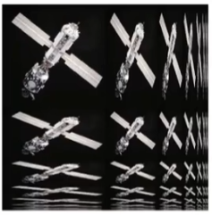

+++
title = 'Games101 Talk 2'
date = 2024-10-14T07:58:06+08:00
draft = false
+++

全写一集里面 vscode 的 md viewer 会卡(感觉是因为要渲染大量 tex 的原因), 所以分段, 分段没有任何时间上的关系.

## Lecture 7 Shading 1 (Illumination, Shading and Graphics Pipeline)

### Z-Buffering

先想一些直观的简单做法

- Painter's Algorithm

  - 像画家一样先画远的再画近的, 新的覆盖旧的
  - 需要按照深度进行排序, 耗时 O(nlogn)
  - 缺点: 无法处理多个互相遮挡的情况.

- Z-Buffer

  - 储存每个像素的最浅深度
  - 需要一个额外的 buffer 储存深度信息
    - frame buffer 储存颜色信息
    - depth buffer 储存深度信息

假设 z 总是正的, z 越小越近

#### Z-Buffer Algorithm

初始深度都是无限远的

```rust
for tri in triangles {
  for sample_point(x,y,z) in tri {
    if z < zbuffer[x,y] {
      framebuffer[x,y] = rgb;
      zbuffer[x,y] = z;
    }
  }
}
```

O(n) for n triangles (assuming constant coverage) O(n), n 是三角形个数, 假设常数个采样

为什么只花了线性时间? 因为只记录了最小值(类似于桶排序)

对于深度不同的情况, 绘制的先后顺序不会有影响

为什么说能假定深度不会相同?

- 坐标一般是浮点数存储, 浮点数很少能判断相等.(但不是没有)

假如使用 MSAA, 可能是对每个采样点而非像素建立 z-buffering

- 缺点: 无法处理透明物体

### Shading

The darkening or coloring of an illustration or diagram with parallel lines or a block of color

#### A Simple Shading Model (Blinn-Phong Reflectance Moddel)

- Specular highlights 高光
- Diffuse reflection 漫反射
- Ambient lighting 环境光

#### Shading is Local 不考虑其他物体的存在(No Shadows will be generated)

- Compute light reflected toward camera at a specific **shading point**

Inputs: 向量都是单位向量

- Viewer direction, $\hat{v}$ 观测方向
- Surface normal, $\hat{n}$ 平面法线
- Light direction, $\hat{l}$ (for each of many lights) 光照方向
- Surface parameters(color, shininess...) 颜色 反射率(光泽度, or specular)

#### Diffuse Reflection (maybe the easiest of the 3 kind of lights)

- Lambert's cosine law: $ \cos \theta = \hat{l} \cdot \hat{n} $
  非直射时, 单位面积接受的能量较少
- Light Falloff $I / r^2 $
  离点光源越远, 分到的能量越少

Lamberian (Diffuse) Shading

$$
L_d = k_d (I/r^2)\max(0,\hat{n} \cdot \hat{l})
$$

$ L_d: \text{diffusely reflected light} $
$ k_d: \text{diffuse coefficient (color)} $
$ I/r^2: \text{energy arrived at the shading point} $
$ \max(0,\hat{n} \cdot \hat{l}): \text{energy received by the shading point} $

$\hat{v}$ has nothing to do with $L_d$ 'cause diffuse reflection doesn't change with $\hat{v}$

## Lecture 8 Shading 2(Shading, Pipeline and Texture Mapping) ...和纹理映射

#### Specular Term

$\hat{v}$ 接近 $\hat{l}$ 的镜面反射的位置, 就可以看到高光.

Blinn-Phong 模型中, 使用半程向量 $\hat{h} = \text{bisector}(\hat{v},\hat{l}) = \frac{\hat{v}+\hat{l}}{||\hat{v}+\hat{l}||} $ 与 $\hat{n}$ 的接近程度 表示 $\hat{v}$ and $\hat{l}$ 接近的程度

$$
L_s = k_s (I/r^2)\max(0,\hat{n} \cdot \hat{h})^p
$$

$ L_s: \text{specularly reflected light} $
$ k_s: \text{specular coefficient} $

#### Ambient Term

Shading that does not depend on anything

- Add constant color to account for disregarded illumination and fill in black shadows
- this is approximate / fake!

$$
L_a = k_a I_a
$$

这只是大概估计, 如果要精确计算, 需要全局光照.

计算所有光照后:

$ L = L_a + L_d + L_s $
$\quad =k_aI_a + k_d (I/r^2)\max(0,\hat{n} \cdot \hat{l}) + k_s (I/r^2)\max(0,\hat{n} \cdot \hat{h})^p $

#### Shading Frequencies 着色频率

- Flat shading 着色应用在每一个平面上

  - Triangle face is flat -- one normal vector
  - Not good for smooth surfaces

- Gouraud shading 着色应用在每一个顶点上

  - Interpolate colors from verties across triangle
  - Each vertex has a normal vector (how?)
  - 计算每三个顶点的围成的三角形内部的颜色(使用插值法, 将顶点的颜色分布到三角形内部的每一个点上)

- 着色应用在每一个像素上

  - Interpolate normal vectors across each triangle
  - Compute full shading model at each pixel
  - Not the Blinn-Phong Reflectance Model

- 这三种越来越精确...吗?

  - 实际要看面数和占的像素数. 模型的面数足够多时, 逐面可能会比逐像素更精确, 消耗更大.

- 顶点的法线是怎么来的呢?

  - 已知几何形体, 可以使用几何性质知道(比如球的法线就是径向)
  - 顶点毗邻各面的法线平均.

$$
N_v = \frac{\sum_iN_i}{||\sum_iN_i||}
$$

- 加权平均是不是会更好呢?

  - 是的, 以面积加权比简单平均更精确

- 逐像素的法线又是怎么来的呢?

  - Barycentric interpolation 重心插值

#### Graphics (Real-time Rendering) Pipeline 图形管线(实时渲染管线)

管线 = 流水线

Input: verices in 3D space
↓ Vertex Processing (MVP transforms)
Vertex Stream
↓ Triangle Processing
Triangle Stream (sampling triangle coverage)
↓ Rasterization
Fragment Stream (Fragments: one per covered sample)
↓ Fragment Processing (Z-Buffer Visibility Tests)
Shaded Fragments
↓ Framebuffer Operations
Output: image (pixels)
↓ Display
show on Screen

- Shading 发生在 Vertex processing or Fragment Processing, 主要看采用哪种着色方式.
- Texture Mapping 让三角形每个点有不同的映射

##### Shader Programs

- Program vertex and fragment processing stages
- Describe operation on a single vertex(or fragment) 对每个单独顶点(或像素)描述操作
- 每个顶点/像素都会执行 shader 的内容(看写的是哪种 shader)

Vertex Shader 顶点着色器
Fragment Shader / Pixel Shader 像素着色器 / 片段着色器

```glsl
uniform sampler2D myTexture;
uniform vec3 lightDir;
varying vec2 uv;
varying vec3 norm;

void diffuseShader()
{
  vec3 kd;
  kd = texture2d(myTexture, uv);
  kd *= clamp{dot{-lightDir, norm}, 0.0, 1.0};
  gl_FragColor = vet4(kd, 1.0);
}
```

#### Texture Mapping

- 3 维物体的表面是 2 维平面(或者是曲面?whatever)
- 将 2 维的纹理映射到 3 维物体表面的过程就是 Texture Mapping
- 找到 3 维物体上的三角形在纹理空间上是哪个三角形
- Each triangle vertex is assigned a texture coordinate (u,v)
- u,v 都属于 [0,1]
- Textures applied to surfaces 纹理可以应用在不同表面上

tileable texture 可衔接纹理

## Lecture 9 Shading 3 (Texture Mapping cont.)

##### Review Shading

- Blinn-Phong Reflectance model
- Shading models / frequencies
- Graphics Pipeline
- Texture Mapping

### Context

- Barycentric coorinates
- Texture queries
- Applications of textures

### Texture Mapping

#### Interpolation Across Triangles: Barycentric Coordinates

- Why interpolate?

  - Specify values at vertices
  - Obtain sommthly varying values across triangles

- What to interpolate with?

  - Texture coordinates, colors, normal vectors, ...

- How to interpolate?

  - Barycentric Coordinates

##### Barycentric Coordinates

A coordiante system for triangle(A,B,C) is ($\alpha, \beta, \gamma$)

$$
(x, y) = \alpha A+\beta B+\gamma C \\
\alpha + \beta + \gamma = 1 \\
\text{(x,y) Inside the triangle if all three coordinates are non-negative}
$$

设三角形内一点 $ P(\alpha,\beta,\gamma) $

$$
\alpha = \frac{A_A}{A_A+A_B+A_C} \\
\beta = \frac{A_B}{A_A+A_B+A_C} \\
\gamma = \frac{A_C}{A_A+A_B+A_C} \\
$$

$A_A,A_B,A_C$ 分别为三角形 $PBC,PAC,PAB$ 的面积.

对三角形重心, 重心坐标为(1/3,1/3,1/3)

- 重心坐标没有投影不变性

##### Applying Textures

for each rasterized screen sample(x,y):
(u,v) = evaluate texture coordinate at (x,y)
texcolor = texture.sample(u,v)
set sample's color to texcolor

##### Texture Magnification (What if texture is too small)

- insufficient texture resolution
- A pixel on a texture -- a texel

###### Nearest Interpolation

- 找最近的 texel 坐标

###### Bilinear Interpolation 双线性插值

1. Take 4 nearest sample locations, with texture values $u_{00}, u_{01}, u_{10}, u_{11}$
2. fractional offsets, (x,y) is (s,t) from $u_{00}$

introduce some concept:

- Linear interpolation(1D):
  $\text{lerp}(x,v_0,v_1) = v_0 + x(v_1-v_0)$

3. use lerp in horizontal:
   $u_0 = \text{lerp}(s,u_{00},u_{10})$
   $u_1 = \text{lerp}(s,u_{01},u_{11})$
4. vertical lerp to get result:
   $f(x,y) = \text{lerp}(t,u_0,u_1)$

- 因为做了两轮插值(3,4), 所以叫双线性插值.
  也可以先竖直后水平, 结果相同.

###### Bicubic Interpolation 双三次插值

- 取的是周围的 16 个 texel, 使用三次函数进行插值而非线性的 lerp 函数插值
- 比 Bilinear 更清晰

##### but, what if texture is too large?

- Point Sampling Textures 纹理分辨率大于屏幕分辨率

  will Supersampling solve?

  - costly
  - cost more and more with higher and higher sampling frequency

  think in another way: what if we dont sample?

  - get the average value of an area

点查询 和 范围查询 range query

###### Mipmap

Allowing (fast, approx., square) range queries
允许快的近似的正方形的范围查询

- Mip comes from the Latin "multum in parvo",
  meaning a multitude in a small space.
- Computing Mipmap Level D

$$
D = \log_2{L} \quad
L = \max(\sqrt{(\frac{du}{dx})^2+(\frac{dv}{dx})^2}, \sqrt{(\frac{du}{dy})^2+(\frac{dv}{dy})^2})
$$

查当前查询的区域在几次 log2 后会变成 1 个像素的大小, 这就是第 D 层, 然后就可以去查那个像素, 作为这个区域的平均值

- Trilinear Interpolation 三线性插值

对于计算出 D 不是整数的情况, 可以在 floor(D)层和 ceil(D)层分别做双线性插值, 然后再在两个结果做线性插值.

- limitations

  - Overblur

    - 1. mipmap 只能正方形区域

    2. 大量近似和插值的不确定性

###### Anisotropic Filtering 各向异性过滤



Ripmaps and summed area tables

- can look up axis-aligned rectangular zones 能查横平竖直的长方形
- Diagonal foorprints still a problem 斜的查不了

EWA filtering

把不规则形状拆成很多圆心相同半径不同的圆形, 然后多次查询这些圆形

- use multiple lookups 多次查询
- weighted average
- mipmap hierarchy still helps
- can handle irregular footprints

## Lecture 10 Geometry 1

### Uses in Texturing

in modern GPUs, texture = memory + range query(filtering)

- General method to bring data to fragment calculations

many applications:

- Environment lighting
- Store microgeometry
- Procedural textures
- Solid modeling
- Volume rendering
- ...

#### Environment Map 环境映射 (环境光照)

例子

- 犹他茶壶
- 斯坦福雕塑
- 康奈尔盒子

环境光照假设是来自无限远处, 只有方向性,没有深度信息

Environment map used to render raelistic lighting

##### Spherical Environment Map 球形环境光照

会有一些扭曲和错位现象

##### Cube Map 立方体映射

- much less distortion
- need dir->face computation

#### Textures can affect shading!

- Textures doesn't have to only represent colors
  - What if it stores the height/normal 凹凸贴图(相对高度)
  - Bump / normal mapping 法线贴图(和凹凸贴图一样)
  - **Fake** the detailed geometry

##### Bump Mapping 凹凸贴图

Adding surface detail w/o dadding more triangles

- Perturb surface normal per pixel
  (for shaidng computatons only)
- "Height shift" per texel defined by a texture
- How to modify normal vector?

###### Normal(in 2D flatland)

1. Origin surface normal n(p) = (0,1)
2. Derivatives at p is dp = c \* [h(p+1)-h(p)]
3. Perturbed normal is n(p) = (-dp, 1).normalized()

###### Normal (in 3D) 法线

1. Origin surface normal n(p) = (0, 0, 1)
2. Derivatives at p are

- dp/du = c1 \* [h(u+1)-h(u)]
- dp/dv = c2 \* [h(v+1)-h(v)]

3. Perturbed normal is n = (-dp/du, -dp/dv, 1).normalized()

- Note: this is in local coordinate!

##### Displacement mapping 位移贴图

- use the same texture as in bumping mapping
- Actually moves the vertices

但位移贴图需要你的模型足够细(三角形足够小)

- 3D Procedural Noise + Solid Modeling

三维噪声

- Provide Precomputed Shading 预计算着色
- 3D Textures and Volume Rendering 体渲染

### 几何

- 描述形状
- 描述曲面
- 描述零件
- 描述布料
- 描述流体
- 描述城市
- 描述毛发

用三角形面不如不用三角形面表示的物体, 就用几何.

- Implicit

给出该几何上的点满足的约束关系.

E.g.
x^2+y^2+z^2=1
f(x,y,z)=0

Implicit Surface - Sampling can be hard 缺点: 隐含表示 难以说出它的形状是什么
f(x,y,z)=(2-sqrt(x^2+y^2))+z^2-1

Inside/Outside Tests Easy 优点, 容易说出一个点在几何的内部/外部, 或者在几何上
f<0, inside; f=0, on; f>0, outside
f(x,y,z)=x^2+y^2+z^2-1 Is (3/4,1/2,1/4) inside?
f(3/4,1/2,1/4) = -1/8 < 0 Yes, inside
