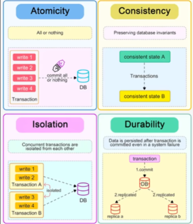

+++
title = 'Make Programming Great Agin'
date = 2024-10-20T05:51:13+08:00
draft = true
+++

## Unix Philosophy

- Do one thing well: Each command has a specific purpose.
- Modularity: Commands work together through simple interfaces(text often).
- Text-based: Text streams are the universal way to connect input and output.
- 
- 

## Database

